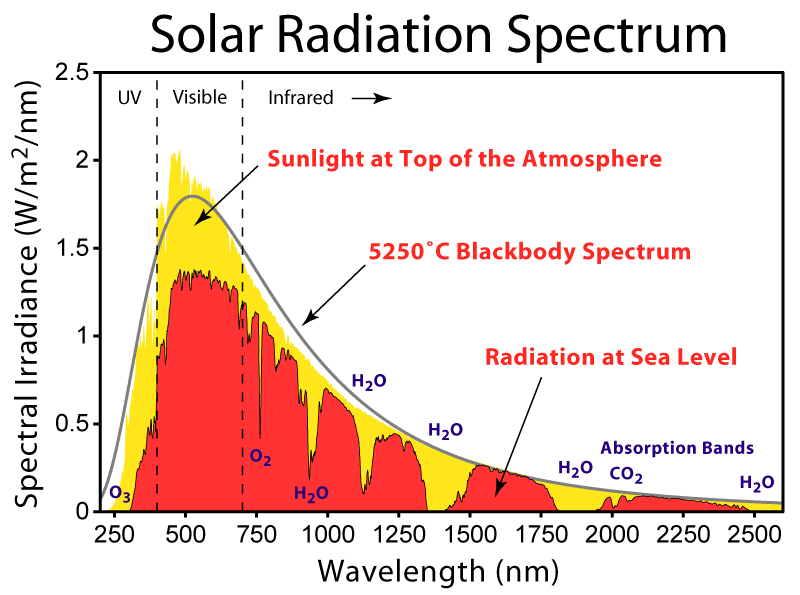

## ENSP 330, Lecture 1, Introduction and Overview
### Professor Daniel Soto, Sonoma State University
### 20 Aug 2013

<!--
- take attendance
- introduce myself
- make myself approachable
-->

## Vision
- The combination of knowledge and skills you gain in this class will
  create a foundation for a lifetime of informed discussion and
  influence in the space of energy.

<!--
- this course is guided by what i want you to be able to do in your
  careers 5, 10, 20, and 50 years from now.
- we will do some things differently and you may find them strange, they
  are all designed to prepare you for what you will actually do in the
  future
-->

## Interview
- What do you want to get out of this class?
- How do you hope to use what you learn here in your career?
- What are you most curious about in the field of energy?
- What are you most concerned about in the field of energy?

<!--
- pick a partner and write down responses for the following questions
- this will be an ungraded assignment
- when finished, briefly introduce your partner to the class
-->

## Syllabus Review
[My Website](http://danielrsoto.com/teaching/syllabus_330.html)

<!--
- course organization
- we begin with a discussion of energy and mathematical fundamentals
- we then cover different sources of energy
- how we use energy
- impacts of energy
- economics and policy
- discuss how tentative schedule is
- talk about selection of texts
-->

## Learning objectives
- You will gain knowledge of energy issues
- You will develop quantitative estimation skills and model thinking
- You will enhance your critical thinking skills
- You will apply research skills to energy issues

## Guiding questions
<!--
- some of these are related to the content
- some of these are not related to the content
-->

## Transfer of knowledge
- Certain energy facts will not change
    - Physics of energy, thermodynamics, economics
- Others will definitely change
    - Cheapest energy source, state of the art in technology, financing
      options

<!--
- can anyone name something in the world of energy that has changed
  significantly in the past several years?
-->

## Quantitative Estimation Skills
- You will leave this class with the ability to quantitatively evaluate
  new ideas for feasibility
- We will develop analytical tools and techniques for energy estimation

<!--
- show of hands, how comfortable are you with mathematics?
- how comfortable are you with physics?
- algebra?
- calculus?
-->

## Model thinking
- A model is an approximation that allows us to think about the world
- All models are wrong, some are useful
- How do we separate facts from opinions?

<!--
- who can name an example of a model?
- who can think of a place where models are useful?
- who knows who nate silver is?
-->

## Critical thinking skills
- How do you gain information about a topic?
- How do evaluate the quality of that information?
- How do you assess the quality of an argument?

<!--
- show of hands, how many are comfortable with this topic?
- i don't feel like i developed this until midway through graduate
  school
-->

## Research skills
- How do you discover more about a topic?
- How do you synthesize this information to answer a question?
- How do you find the right question to ask?

## Questions

## ENSP 330, Lecture 2, History of Energy
### Professor Daniel Soto, Sonoma State University
### 22 Aug 2013

<!--
- energy technologies have positive and negative effects
-->

<!--
- announcements
- logistical questions
- moodle access
-->

## What is energy?
- Energy is an accounting device
- Energy is never destroyed or lost, only converted

<!--
- word coined by aristotle
-->

## Basic Concepts
- Force
- Work
- Energy
- Power

<!--
- run through each concept
- apple weighs about 100g
- difference between work and energy is subtle
- can you come up with an example from each of these this morning?
-->

## Forms of Energy
- Gravitational
- Chemical
- Kinetic
- Radiation

## Energy conversion
- Conversion of energy is the key to making it useful
<!--
- example: chemical energy to mechanical energy
- write down an energy conversion from your life this morning
-->

# Energy in Antiquity

## Biological Energy Conversion
- Plants convert radiant energy into chemical energy
- Humans convert chemical energy into human activity
<!--
- We essentially burn food in our bodies
- since all fossil fuel comes from plants, it is essentially solar
-->

## Food Gathering Techniques
- Foraging
- Hunting
- Agriculture
- Livestock
<!--
- how can you see each of these in terms of energy?
- can we think of energy impacts of our modern food system?
-->

## Fire
- Stored chemical energy in wood to heat
- Allowed for tool making
- Allowed for cooking
<!--
- Richard Wrangham, primatologist argues that:
- cooking saves energy in digestion
-->

## Fire Sources
- Wood, biomass, dung
- Coal
- Coke
- Oil
- Gas
<!--
- what sources do humans burn for use
-->

## Amplifying human power and energy
- Ancient machines
    - Lever
    - Spring

<!--
- lever converts small force over large distance to large force over
  small distance
- springs store energy as mechanical potential energy
-->

## Hunting Machines
- Bow and arrow
    - energy is stored in bow and release quickly
- Spear and Lever
    - Lever allows hunter to impart more kinetic energy to the spear
      than with the arm alone
- Guns
    - Chemical energy converted to kinetic energy in bullet

<!--
- this advantage lead to higher energy input in human diets
-->

## Human Thermoregulation
- Our superior ability to remove heat energy from our bodies allows us
  to outrun prey animals

# Beyond Human Power

## Livestock
- Oxen
- Horses
- Allowed humans to cultivate more land, but required more land for food
<!--
- Horsepower
-->

## Water power
- Water wheels
    - converts kinetic and potential energy in water to rotational
      motion
    - estimated 500,000 waterwheels in Europe

## Water photos
[Syrian Waterwheel](http://en.wikipedia.org/wiki/File:Hama-3_norias.jpg)

## Wind power
- Windmills
    - converts kinetic energy in the wind to rotational motion
    - Dates to Ancient Greece
    - 12th century in Europe
    - estimated 200,000 windmills at peak in Europe
    - estimated 600,000 windmill waterpumps at peak in 1930 in United States
- Sailing
    - Allowed long distance travel

<!--
- transatlantic voyages made possible by windpower
- these first energy sources were renewable
- population in 1930 was about 122 million so about 200 persons per
  windmill
-->

## Windmill Photos
[Estonian Windmill
Photo](http://en.wikipedia.org/wiki/File:Kuremaa_m%C3%B5isa_tuuleveski.jpg)

[South Dakota Wind Pump Photo](http://en.wikipedia.org/wiki/File:Old_Windmill.jpg)

[Modern Wind
Farm](http://en.wikipedia.org/wiki/File:Shepherds_Flat_Wind_Farm_2011.jpg)

# Energy in the Fossil Fuel Era

## Steam Engine
- Invented by James Watt in approximately 1770
- Converts of chemical energy to heat to motion
- Created shift in manufacturing technology

## Internal Combustion Engine
- Inventions in the 1800s lead to first automobile patent by Karl Benz
  in 1886
<!--
- on paper write down positive and negative aspects of modern
  transportation
- then share with partner and then with class
- what are positive effects of transportation
    - goods, services
- what are negative effects?
    - pollution
    - deaths and injury
-->

## Electrification
- Coal is used as the fuel for electricity generation
<!--
- on paper, write down positive and negative aspects of electricity
- share with partner and then group
- positive effects of electricity?
- negative effects?
-->

# Consequences of Fossil Fuel Use

## Global Warming
- Widespread use of these fuels causes an increase in fossil carbon in
  the atmosphere
- Arhennius in 1896 calculated how changes in the levels of CO$_2$ could
  alter surface temperature

## Hockey Stick Chart
[MBH 1998 temperature patterns](http://www.meteo.psu.edu/holocene/public_html/shared/articles/mbh98.pdf)

## CO$_2$ Record
[National Oceanic and Atmospheric Administration Earth System Research
Laboratory](http://www.esrl.noaa.gov/gmd/ccgg/trends/)

## Human Influence
[IPCC summary](http://www.grida.no/publications/other/ipcc_tar/?src=/climate/ipcc_tar/wg1/006.htm)

<!--
- what is beyond dispute
- what is still under debate
-->

## Nuclear Energy
- Mass converted to thermal energy
- 1950s see the first nuclear power plants
<!--
- still the same concept
- heat is used to boil water and power a turbine
-->

## Solar Energy
- Photoelectric effect discovered in 1916 by Millikan
- 1950s solar photovoltaic cells used on satellites
- Today, widespread use in private and commercial generation

## Solar Adoption
- 40 years to get to 50 GW of PV capacity
- 50 GW again in the last 2.5 years
- [Cumulative Solar From IEA-PVPS ](http://www.urbanphotovoltaic.com/Portals/0/solutions/photovoltaic/GlobalSolarInstallation-92-12%20Download.JPG)

## Future Energy Technologies?

<!--
- science-fiction time! name an invention, no matter how outlandish,
  that could impact or eliminate an energy use today.
    - efficient teleportation would eliminate car trips
    - hologram teleconferencing
    - 3D printing eliminates shipping
-->

<!--
- next time, energy physics, math, estimations
-->
## ENSP 330, Lecture 3, Energy Units and Estimations
### Professor Daniel Soto, Sonoma State University
### 27 Aug 2013

## Scientific Notation
- How do we express very large and very small numbers?

## A very large number
- Avogadro's Number
- $6.02 \times 10^{23}$ (1/mole)
- $10^{1}$ = 10
- $10^{2} = 10 \times 10$
- $10^{3} = 10 \times 10 \times 10$

## A very small number
- Gravitational Constant
- $6.67 \times 10^{-11} (m^3 kg^{-1} s^{-2})$
- $10^{-1} = \frac{1}{10}$
- $10^{-2} = \frac{1}{10 \times 10}$
- $10^{-3} = \frac{1}{10 \times 10 \times 10}$

## Standard Prefixes
[table of SI
prefixes](http://cshsyear10maths.global2.vic.edu.au/files/2008/08/standard-form-table.png)

## Operations
- Addition
- Subtraction
- Multiplication
- Division

## Scale of energy quantities

- from IPCC Energy Primer

## Exercise
- List some units you know that use SI prefixes

## Exercise
- Write down the population of the world in scientific notation
- According to BP statistical review, 2008 worldwide energy consumption
  was 474 exajoules.  Write this number with and without scientific
  notation.

## Energy Units
- Joule
    - SI Unit.  One Newton-Meter.
- Kilowatt-Hour
    - Energy consumed by 1 kW load over one hour
- Calorie
    - Energy to heat one gram of water one degree Celsius
- Kilo-calorie
    - One thousand calories.  Used in food energy content.
- British Thermal Unit (BTU)
    - Energy to heat one pound of water by one degree Fahrenheit
- Quad
    - One quadrillion ($10^{15}$) BTU

## Unit Conversions
- We may wish to compare energy units that are not consistent
- Often you can look up conversions in a table
- Other times you may need to recreate the conversion

## Exercise
- Convert miles per hour to meters per second
- Calculate the number of seconds in a year

<!--
possible homework questions
- convert from btu to kWh
- convert from btu to gasoline equivalent
- car, what is cost difference in fuel for CAFE standards 20 years ago and today?
-->

## Back of the Envelope Calculations
- Construct a model of appropriate complexity
- Gather estimates of necessary quantities
- Calculate estimate
- Evaluate for feasibility

## Exercise
- Estimate the daily use of gasoline in the US

## ENSP 330, Lecture 4, Energy in the Biosphere
### Professor Daniel Soto, Sonoma State University
### 29 Aug 2013

## Major sources of energy on Earth
- Sunlight
- Internal radioactive decay
- Gravitational Potential
- Tidal Energy

## Solar radiation
- Conversion of mass energy to radiation
- Converts hydrogen to helium

## Solar radiation
- [Solar
  Reaction](http://m.teachastronomy.com/astropedia/article/Nuclear-Reactions-in-Main-Sequence-Stars)

## Solar Energy
- Approximately 1000 watts per square meter on the surface of the earth
  at peak
- 170 watts per square meter average insolation

## Solar Spectrum
[Solar
Spectrum](http://upload.wikimedia.org/wikipedia/commons/4/4c/Solar_Spectrum.png)

## Solar Energy Budget
[Solar Energy Budget
(nasa.gov)](http://science-edu.larc.nasa.gov/EDDOCS/images/Erb/components2.gif)

## Solar radiation
- Solar radiation drives many processes on Earth
- Wind
- Waves
- Ocean Currents
- Atmospheric Currents

## Water evaporation
- Latent heat absorbed during evaporation of water
- Latent heat released during rain

## Producers
- Plants
- Algae
- Convert radiation energy to chemical energy
- Create biofuel for all organisms

## Efficiency
- A measure of how well a resource is converted
- Defined as desired energy out divided by energy in
- $\eta = \frac{E_{out}}{E_{in}}$

## Exercise
- List some examples of efficiency measurements you are familiar with

<!--
we couldn't come up with any, really.
says something about efficiency and society that we don't have language
for it.
miles per gallon
lumens per watt
-->

## Efficiency of plants
- How efficiently do plants convert sunlight into biomass (chemical
  energy)?

## Exercise
- How would you calculate the efficiency of crop production?
- What would be input energy?
- What would be output energy?
- What do you exclude from your model?

## Net Primary Production
- Intensive crops average 2% efficiency
- Global production is 120 billion tons on land and 110 billion tons in
  oceans per year

## Consumers
- Primary Consumers
    - Herbivores
    - Insects
- Secondary, Tertiary Consumers
    - Carnivores
    - Omnivores

## Energy pyramid

[Biomass
Pyramid](http://online.morainevalley.edu/websupported/bio112/biomasspyramid.jpg)

## Livestock
- Cows are herbivores
- How much sunlight energy goes into each kilogram of beef?
- What is the chemical energy?

## Exercise
- How efficient is beef production?
- What would be the input energy?
- What would be the output energy?

## Energy content of foods
- Carbohydrates 17 MJ/kg
- Protein 23 MJ/kg
- Lipids 39 MJ/kg

## Energy inputs to food production
- Mechanization of tilling, harvest
- Transportation of food
- Processing
- Refrigeration and storage

<!--
- need to do quick refresher on area and volume
-->

## Exercise
- If you consume 2500 food calories per day, how many joules is that?
- What is your equivalent rate of power consumption in watts?
- How many acres of wheat could supply you with this energy?

<!--
100 g hard red winter wheat
energy 1368 kJ
energy 327 kcal
yield 41.7 bushels per acre
yield 2.24 metric ton per hectare
hectare = 10^4 square meters
-->

## Exercise
- What was most interesting point from readings
- What did you disagree with?
- What would you like to learn more about?

## ENSP 330, Lecture 5, Energy Conversion
### Professor Daniel Soto, Sonoma State University
### 3 Sept 2013

## Energy Conversion
- Energy must be converted
- Often energy must be transported

<!--
- announcements
- internship deadline today
- is everyone getting emails about readings and assignments?
- assignment sent out today, due next tuesday start of class
10:05
-->

## Types of energy conversion
- Matrix of energy conversions

<!--
- at whiteboard, enumerate different transitions with help from class
- radiation, chemical, thermal, kinetic, electrical, nuclear,
  gravitational
- generators
- motors
- batteries
- photosynthesis
- waterfalls
- muscles
- joule heating
-->

## Efficiency
- A measure of how well a resource is converted
- Defined as useful energy out divided by total energy in
$$\eta = \frac{E_{out}}{E_{in}}$$

## Efficiencies
- Electrical generators (70--99%)
- Electric motors (50--90%)
- Gas furnace (70--95%)
- Wind turbine (35--50%)
- Fossil fuel power plant (30--40%)
- Nuclear power plant (30--35%)
- Automobile engine (20--30%)
- Solar cell (5--28%)
- Fuel cell (40--60%)

<!--
- how efficient could these be?
- we will answer these questions in the coming lectures
-->

## Multiplication of efficiencies
- When we want to know the efficiency of a process with many steps, we
  multiply the efficiencies at each step to get the total.
$$\eta_{total} = \eta_1 \cdot \eta_2 \cdot \eta_3 \cdots$$

## How do we measure efficiencies?
- How do we measure energy?

## Kinetic energy
- The kinetic energy of a moving object is proportional
    - mass of the object
    - square of the object's velocity
$$E_{kinetic} = \frac{1}{2} m v^2$$

## Kinetic energy

## Exercise
- Calculate the kinetic energy in a car traveling down 101
- Express units in joules and kWh
- What quantities do you need to know?  In what units?

<!--
we'll arrive at estimates together
calculate independently
-->

## Gravitational potential energy
- The stored gravitational energy of an object is proportional to
    - mass of the object
    - the height difference
    - gravitational acceleration (9.8 m/sec^2)
$$E_{gravitational} = m g \Delta h$$

## Gravitational potential energy

## Exercise
- Drive the same car from the beach to the top of Mount Tamalpais
- What is the gravitational potential energy relative to the beach?
- Calculate in joules and kWh

<!--
elevation 2572 feet, 784 meters
-->

## Thermal energy
- Thermal energy proportional to
    - mass of the object
    - difference in temperature
    - heat capacity of material
$$Q = E_{thermal} = m c \Delta T$$

## ENSP 330, Lecture 6
### Professor Daniel Soto, Sonoma State University
### 5 Sept 2013

## Announcements
<!--
announcements
PGE classes
internships
scan newspapers for energy articles
fukushima groundwater concerns
problem set correction 1990 -> 1980
questions on problem set?
unit conversion notes
-->

## Thermal energy
- Thermal energy proportional to
    - mass of the object
    - difference in temperature
    - heat capacity of material
$$Q = E_{thermal} = m c \Delta T$$

## Temperature
- Measure of the internal energy in a system or material
- This energy is the motion, vibration, or rotation of atoms and
  molecules

## Heat
- Heat is the flow of this energy from one area to another

<!--
draw temperature
draw heat flow
-->

## Methods of heat transfer
- Conduction
- Convection
- Radiation

## Chemical energy
- Heat of combustion
- Higher heating value
- Lower heating value

## Fuels
- Gasoline 44--45 MJ/kg
- Crude oil 42--44
- Natural gas 33--37
- Anthracite coal 29--31
- Bituminous coal 22--26
- Lignite coal 12--20
- Wood 14--16
- Straw 12--15

## Exercise
- Using one kg of coal
    - How much energy (in J) is the coal?
    - How much electricity in kWh can we generate assuming 35% efficiency?
    - How much water can we raise in temperature from 15C to 50C
      assuming 100% efficiency?

<!--
make a list of assumptions and units
draw on board to support exercise
anthracite coal 30 MJ/kg
3.6 MJ/kWh
how much electricity if 100% efficient?
how much if 30% efficient?
-->

## Exercise
- How much energy did it take to heat your shower water this morning?
- Calculate in joules and kWh

<!--
make a list of assumptions and units
this is part back of the envelope and part calculation
how long is your shower?
how much water per minute? 2 gallons per minute
how much volume per mass? 3.79 liters per gallon
we can derive heat capacity from calorie
4.186 J per g of water
how hot is shower water?
how hot did it start?
-->

# Thermodynamics and heat engines

## Heat Engines
- Stored chemical energy is burned to create thermal energy
- Thermal energy is converted into mechanical work

## Heat Engine

## Carnot Heat Engine

- Heat is used to expand a gas and do work and heat is removed during
  the compression of the gas.

## Power plant

## Power plant

## Heat Engines
- Heat engines have limits to efficiency dictated by the laws of
  thermodynamics
- Maximum possible efficiency is related to the temperature of the hot
  reservoir and of the cold reservoir

## Zeroth Law of Thermodynamics
- If two systems are each in thermal equilibrium with a third system,
  they are also in thermal equilibrium with each other.

## First Law of Thermodynamics
- Energy is conserved
- Energy cannot be created or destroyed
- "You can't get something for nothing"

## First Law Efficiency
- Most commonly used measure of efficiency
- Useful energy out divided by total energy in

## Second Law of Thermodynamics
- The amount of entropy (disorder) in a closed system always increases
- Heat flows spontaneously from hot to cold
- "You can't break even"

## Second Law Efficiency
- First law efficiency divided by best possible efficiency dictated by
  the second law
- It isn't always obvious what the best possible second law efficiency is

## Third law of Thermodynamics
- The entropy of a perfect crystal at absolute zero is exactly equal to
  zero.
- When we make calculations using the second law, we use the kelvin
  temperature scale which starts at absolute zero.

## Temperature Scales

## Entropy
- Measures the disorder in a system
- Is related to the number of microstates

## Quality

## Quality

## Thermodynamic limit to heat engine
- Carnot derived the upper limit of efficiency for a heat engine
$$\eta = 1 - \frac{T_C}{T_H}$$

<!--
what happens when T_C goes to zero?
what happens when T_C and T_H are close to each other?
-->

## Power plant

## Power plant

## ENSP 330, Lecture 7
### Professor Daniel Soto, Sonoma State University
### 10 Sept 2013

## Announcements
<!--
is anyone following AB 327?
toolkit readings posted to moodle

-->

## Modeling
- Using mathematics to predict the natural world
- Both science and art

## A small electric water heater
- Power supply
- Electric Resistor
- Water
- Insulated container

## Exercise
- Electric Water Heater
- Draw diagram of system
- Where is energy going?
- Calculate temperature rise after 10 minutes

## Drawings and representations
- Drawing that captures physical layout
- Diagram that captures energy flows
- Mathematical representation

## Physical drawing

## Energy diagram

## Mathematical representation

## Getting quantitative
- How do we determine the energy from the resistor?
- How do we determine the rise in temperature?
- Do we have our units consistently expressed?

<!--
one drawing may be an accurate reflection of the system
another drawing may be a better way to depict energy flows
-->

## Estimate the temperature rise of the water in 10 minutes

## Exercise
- Using 2 kg of coal with heat content of 30 MJ/kg
    - How much energy (in J) is the coal?
    - How much water can we raise in temperature from 15C to 50C
      assuming 100% efficiency?

## Exercise
- Using 2 kg of coal with heat content of 30 MJ/kg
- How much electricity in kWh can we generate assuming 35% efficiency?

<!--
make a list of assumptions and units
draw on board to support exercise
anthracite coal 30 MJ/kg
3.6 MJ/kWh
how much electricity if 100% efficient?
how much if 30% efficient?
-->

## Exercise
- How much energy did it take to heat your shower water this morning?
- Calculate in joules and kWh

<!--
make a list of assumptions and units
this is part back of the envelope and part calculation
how long is your shower?
how much water per minute? 2 gallons per minute
how much volume per mass? 3.79 liters per gallon
we can derive heat capacity from calorie
4.186 J per g of water
how hot is shower water?
how hot did it start?
-->

## Reading Discussion
- Lovins, Energy Strategy: The Road Not Taken?

<!--
article notes
- what is lovins arguing?
- what are the central points in his essay?
- is he convincing?
- what is a subsidy?
- which path did we follow?
- what does the consumption data say about predictions in II?
- what is a capital cost?
- why is capital cost of electricity so much more expensive than coal?
- can we show this in a calculation?
- Since we can't keep the bathtub filled because the hot water keeps running
  out, do we really (as Malcolm MacEwen asks) need a bigger water heater, or
  could we do better with a cheap, low-technology plug?
- technical fixes and social changes
- avoided cost of energy (capital cost)
- what is the argument for efficiency?
- what is life cycle costing?  (difference between mpg and whole car cost)
- official predcitons are 130-170 quads primary energy, what is reality?
- what is energy income vs energy capital?
- what is energy quality?
- why is electricity overused in amory's opinion?
- why isn't solar a soft technology?
- what kinds of solar are not soft?  why not?
- IX democratized power production
- "the most important questions of energy strategy are social and ethical"
- lovins believes we can almost eliminate electricity

-->

## California Electricity Consumption

## Did Lovin's prediction come true?
[Follow up to road not taken](http://softpathinnovations.com/SoftPath/About_Us_files/Energy%20Strategy-%20The%20Road%20Not%20Taken.pdf)

## ENSP 330, Lecture 8
### Professor Daniel Soto, Sonoma State University
### 12 Sept 2013

<!--
- announcements
- research project
- pick a topic you are interested in related to energy
- this can be an energy source, an efficiency technology or a social shift that improves our energy system
- your paper should demonstrate the potential of the topic for improvement
- both written paper and oral presentation
-->

<!--
- where do we get them
- how do we use them
- why are they useful
- how are they harmful
- how long will they last
-->

# Fossil Fuels

## Types of Fossil Fuels
- Coal
- Petroleum
- Natural Gas

<!--
- fossil fuel etymology latin fossilis dug up
-->

## Origin of Fossil Fuels

##

##

##

##

##

##

## Petroleum prices

## Petroleum use

## Natural gas use

## Coal use

## Total energy use

<!--
## Extraction methods for coal

## Extraction methods for petroleum

## Extraction methods for natural gas
-->

## Impacts of extraction methods
- What are the benefits of extraction?
- What are the costs of extraction?

<!--
- exxon valdez 1989 prince william sound, alaska
- deepwater horizon explosion 2010
- sago mine 2006 disaster
-->

<!--
## Benefits of fossil fuels

## Drawbacks to fossil fuel use

## Energy return on investment

## Fossil fuel prices in real dollars

## Increased cost with unconventional sources

-->

## Energy independence

## Carbon intensity

## Fossil Fuel Subsidies
- exploration expensing
- unpriced externalities

## Politics
- 2006 House passed bill to allow immediate offshore drilling
- Arctic National Wildlife Refuge (ANWR)
- Drilling on federal lands

## Supply and demand
- Does increased domestic drilling lower domestic prices?
<!--
- does increased energy supply decrease prices?
-->

<!--
## Efficiency of conversion

## Efficiency calculation example
- Coal plant

## Numerical Examples

## Heat Rate in Power Plant

## Limit of refrigerator efficiency

## Segue into laws of thermodynamics

## Heat Engine

-->

## ENSP 330, Lecture 9
### Professor Daniel Soto, Sonoma State University
### 17 Sept 2013

## Announcements

<!--
AB 327 - net metering and rate reform
SB 43 -
AB 217
AB 792
SB 4 - fracking oversight
SB 54 - improved safety at refineries by mandating trained workforce
SB 448 - protects against market manipulation of gasoline prices
-->

# Quantitative Intuition

## Calculate energy in these
- Cell phone battery
- Laptop battery
- Tank of gasoline
- Railroad car of coal
- Power bar

## Energy comparisons

## Power comparisons

<!--
- mustang engine
- coal power plant
- hydroelectric power plant
- tornado?
- sun?
- planets power needs
-->

## Worlds largest coal plant
- [Taichung Power Plant](https://maps.google.com/maps?ll=24.212778,120.481111&q=loc:24.212778,120.481111&hl=en&t=h&z=15)
- 5.78 GW
- How much energy does this plant deliver in a year?

## Difference between power and energy for
- Power plant
- Solar panel

# Macro energy picture

## Definitions

## Energy and GDP
[Energy vs GDP by country](http://www.withouthotair.com/c30/figure242.png)

## Energy Intensity

## Energy per capita

##

##

##

##

##

##

<!--
## Gross Domestic Product

## Energy intensity

## Decoupling of energy intensity and GDP

## Primary Energy

## Secondary Energy

## End-use Energy
-->

## ENSP 330, Lecture 10
### Professor Daniel Soto, Sonoma State University
### 19 Sept 2013

## Announcements

<!--
hand back class exercises
shaheen portman
warren crapo

-->

<!--
US energy per capita over time
US electricity per capita over time
US energy intensity over time
US per capita carbon emissions over time

world energy per capita over time

-->

# Macro energy picture

## Definitions
- Gross Domestic Product (GDP)
- Per capita GDP (GDP per person)
- Per capita energy use (Joules per person)
- Energy intensity (Joules per GDP)

## US primary energy intensity

## Annual residential energy per capita

## Per capita electricity consumption

## US electricity consumption
- 
- let's do rough conversion to per capita

## Consumption growth

## State energy consumption per capita
- 
- Why does California have high consumption but low consumption per capita?

## US carbon emissions
- 
- What are possible reasons for the increase over time?
- For the decrease recently?

## US primary energy consumption

## US oil consumption

## Energy and GDP
[Energy vs GDP by country](http://www.withouthotair.com/c30/figure242.png)

##

##

##

##

<!--
## Gross Domestic Product

## Energy intensity

## Decoupling of energy intensity and GDP

## Primary Energy

## Secondary Energy

## End-use Energy
-->

# Life Cycle Analysis

## Life Cycle Analysis
- Uses energy or economic inputs throughout the entire life cycle of a
  product or process to evaluate efficiency.
- Initial Costs
- Recurring Costs

<!--
What are the initial costs for a solar farm?
What are the recurring costs for a solar farm?

What are the initial costs for a coal power plant?
What are the recurring costs for a coal power plant?
-->

## Compare two cars
- Honda Civic, $18165, 28 city, 39 highway
- Honda Civic Hybrid, $24360, 44 city, 44 highway
- What is the cost of gas per year assuming 15000 miles per year at a gas cost of 3.50 per gallon?

## Light bulbs
- Incandescent GE Reveal, $1.46, 1000 hours, 630 lumens
- LED, Philips, $50, 30000 hours, 940 lumens
<!--
$1.46 / 1000 = $0.00146/hour
$50/30000 = 0.00167/hour
-->
- What is the capital cost of the bulb per hour
- What is the cost of electricity to run each bulb for a year?

## ENSP 330, Lecture 11
### Professor Daniel Soto, Sonoma State University
### 19 Sept 2013

## Announcements

<!--
EPA carbon limits for electricity plants

http://www2.epa.gov/carbon-pollution-standards/2013-proposed-carbon-pollution-standard-new-power-plants

freshman pizza with upper classmen noon this friday with the engineering
math and science freshman interest group.  looking for phys, eng, math,
kin, ensp majors Dr Guilford.

crime prevention through environmental design, tuesday oct 1 2013
5pm - 6:30 pm ETC

-->

## Life Cycle Analysis
- Initial (Costs, Carbon, Pollutants)
- Recurring (Costs, Carbon, Pollutants)

## Automobile example
- Initial costs
	- purchase
- Recurring costs
	- maintenance
	- fuel

## Light bulb example
- Initial costs
	- purchase
	- installation
- Recurring costs
	- electricity

## Carbon Intensity
- Embedded carbon
- Carbon Intensity of Electricity
- Coal 2009 Average 2249 lb CO2/MWh
- Natural Gas 1135 lb CO2/MWh
- Hydro, Wind, Solar, Nuclear 0 lb CO2/MWh
- Proposed EPA Limit 1100 lb CO2/MWh for coal
- 1000, 1100 lb CO2/MWh for natural gas

## Carbon Intensity Data
- Available at EPA eGRID
- Environmental Protection Agency
- Emissions and Generation Resource Integrated Database

## Generation Mix

## State Electricity Carbon Intensity Averages
- Washington 287 lb/MWh
- California 633 lb/MWh
- Virginia 1232 lb/MWh
- West Virginia 2027 lb/MWh

## Averages
- Estimate average carbon intensity from percentages
- Review
    - Arithmetic mean or average
    - Means based on percentages

# Nuclear Energy

## Nuclear energy
- Nuclear energy used for electricity
- Very similar to fossil fuel plants

<!--
link to other concepts
- second law of thermodynamics
- heat engine
- inital cost, recurring cost, fuel cost
- capacity factor
-->

##

## Fusion vs Fission
- Fusion joins atomic nuclei
- Sun is a fusion reaction
- Fission splits atomic nuclei
- Nuclear energy is a fission reaction

##

## Atomic Theory

## Electronic vs Nuclear Energy Levels
- Mass Energy Equivalence
- $E = mc^2$
- The very high binding energy in the nucleus allows for small amounts
  of fuel to release large amounts of energy

## Nuclear Decay
- Elements become other elements
- Iron most stable

##

## Nuclear Fuel

##

##

##

##

##

##

## Nuclear Waste Disposal

## Half Life
- Definition
- Relation to carbon dating
- Relevance to end of life

## Half Life

## Nuclear waste
- Very long lifetime

##

##

##

##

##

## Capacity vs Delivered Electricity
- US Nuclear Capacity
- US Nuclear Energy Production

## Lifetime cost of nuclear electricity
- Plant construction
- Fixed operation and maintenance
- Variable operation and maintenance
- Decommissioning cost
- Waste disposal

## Lifetime cost of nuclear electricity
- cost of construction 83.4 USD/MWh
- fixed operation and maintenance 11.6 USD/MWh
- variable operation and maintenance (fuel) 12.3 USD/MWh
- total 108.4 USD/MWh
- compare to coal (65.7, 4.1, 29.2, 100.1)
- compare to natural gas (17.4, 2.0, 45.0, 67.1)

## Discussion
- How do we compare two different environmental risks?

## ENSP 330, Lecture 12
### Professor Daniel Soto, Sonoma State University
### 26 Sept 2013

## Announcements

## Patrick Moore Testimony
- What is Moore arguing?
- What parts of his argument do you find compelling?
- What parts of his argument do you find lacking?
- What are the reasons for his conclusion?

<!--
evidence
unfair comparisons
value conflicts
- how would you investigate his reasons for yourself?
- what would it take to scale up?
-->

# Life Cycle Analysis

## Light bulb example
- Initial costs
	- purchase
	- installation
- Recurring costs
	- electricity

## LED Bulb
- $13, 9.5 watts, 800 lumens, 25000 hours

## Incandescent Bulb
- $0.50, 60 watts, 860 lumens, 1000 hours

## Carbon Intensity
- Embedded carbon
- Carbon Intensity of Electricity
- Coal 2009 Average 2249 lb CO2/MWh
- Natural Gas 1135 lb CO2/MWh
- Hydro, Wind, Solar, Nuclear 0 lb CO2/MWh
- Proposed EPA Limit 1100 lb CO2/MWh for coal
- 1000, 1100 lb CO2/MWh for natural gas

## State Electricity Carbon Intensity Averages
- Washington 287 lb/MWh
- California 633 lb/MWh
- Virginia 1232 lb/MWh
- West Virginia 2027 lb/MWh

## Calculate lifetime cost
- We consider initial and electricity cost
- We choose a convenient period of time to analyze

## Calculate cost of conserved energy
- Buying a more efficient technology is like buying electricity you were
  already going to use at a cheaper price

## Estimate mass of carbon emissions avoided
- We use the carbon intensity of the electric grid and the amount of
  electricity saved

## What have we ignored?
- How could we improve the accuracy of these calculations?
- When would we need greater accuracy?

<!--
- calculate cost of electricity per year
- calculate cost of electricity over bulb lifetime
- compare LED and CFL
- calculate carbon emitted for each per year, per lifetime
- calculate cost of conserved energy
- compare to the cost of daylighting

- analyze as an investment
- what is simple payback?
- what is return on investment?

- cheapest thing to do is sit in the dark
- we must compare to something sensible

- there is lots of flexibility in the analysis here
- do i count the difference in initial cost?  electricity cost?
- thats why the clarity of your methods matters

- discuss second order costs
- incandescent heating
- window energy leakage

- pose the choice between buying electricity at $0.15 cents or $0.05
  cents
- pose the choice between carbon tax or avoiding tax

- we are neglecting the time value of money

-->

## Carbon Abatement Curve
- Calculates the cost and amount of carbon that could be saved by
  various efficiency technologies

## Carbon Abatement Curve

## ENSP 330, Lecture 13
### Professor Daniel Soto, Sonoma State University
### 1 Oct 2013

## Announcements
- Garden Volunteers
- Reading posted
- Research project
- Peer assessment on problem set

## Upcoming Deadlines
- Homework 2 Due Thursday, October 3rd
- Homework 1 Makeup Due Tuesday, October 8th
- 2 minute research presentations, October 8th
- Midterm Thursday October 24th

# Hydropower

## Ancient Power Technology
- Waterwheels have been used for centuries
- Modern hydropower technology has added large scale dams

## Hydropower is significant world wide
- http://wdi.worldbank.org/table/3.7
- 2010 Hydropower 15.9% of world wide electricity
- Coal 40.5%, Nuclear 12.8%
- Largest power station in the world is hydroelectric

## Three Gorges
- Largest power plant in the world
- Displaced millions of people
- 22 GW power continuous
- NYC - 10 GW

## Three Gorges

## Three Gorges
[Three Gorges
Satellite](https://maps.google.com/maps?ll=30.823056,111.003333&q=loc:30.823056,111.003333&hl=en&t=h&z=14)

## Grand Coulee
- Largest hydroelectric installation in US
- 6.8 GW capacity
- 21 Billion kWh annual energy delivered

## Hydropower

### Advantages
- Once built, very cheap power
- Reliable technology
- Can be used as storage

### Disadvantages
- Environmental impacts
- Seasonal variation

## Hydropower

## Hydropower

## Hydropower

## Hydropower

## Hydropower
- Uses spinning generators just like combustion plant
- Doesn't use heat, unlike combustion plant

## Turbine types

### Waterwheels
- Undershot
- Breastshot
- Overshot

### Turbines
- Impulse
- Reaction

## Hydropower turbines

## Hydropower turbines

## Hoover Dam

## Hoover Dam

## Scalability
- Hydropower can be produced at small scale

## Hydropower

## Hydropower

## Small Scale Hydropower

## Small Scale Hydropower

## ENSP 330, Lecture 14
### Professor Daniel Soto, Sonoma State University
### 3 Oct 2013

## Announcements

## Upcoming Deadlines
- Homework 1 Makeup Due Tuesday, October 8th
- 2 minute research presentations, October 8th
- Midterm Thursday October 24th

<!--
what do you want to know about solar power?
-->

# Solar Energy

## Solar energy
- Radiant energy from the sun is converted to
- Heat
- Electricity

## Solar energy uses
- Electricity production
- Hot water
- Space heating
- Lighting

## Solar energy
- Peak solar power about 1000 watts per square meter
- Solar power is usually measured for this level of sunlight
- However, sun is not always this bright
- Our sunniest locations get about 5.5 kWh per square meter per day of sun energy

<!--
relate this level of power to 1kW loads
toaster, hair dryer
-->

## Global solar resource

## Types of solar electric plants
- Photovoltaic
- Power tower
- Parabolic

# Photovoltaic electricity plants

## Solar Photovoltaic
- Converts sunlight directly to electricity
- Commercially available panels have 15% -- 20% efficiency of solar
  energy in to electrical energy out

## Agua Caliente
- Highest power photovoltaic power facility
- Yuma, Arizona
- 397 MW peak production
- 25 year power purchase agreement

## Agua Caliente Data
- http://www.eia.gov/electricity/data/browser/#/plant/57373

## Agua Caliente satellite
- Palomas Road, Dateland AZ

## Solar Photovoltaic

### Advantages
- Low operating cost

### Disadvantages
- High initial cost

<!--
agua caliente has a
$967 million loan guarantee from DOE?
-->

<!--
how many have burned ants with a magnifying glass?
-->

# Solar thermal plants

## Parabola

## Concentrating solar power trough

## SEGS
- Solar Energy Generating Systems
- First solar thermal plants
- Daggett, CA
- Built in 1984 and 1985

<!--
solar mineral oil tank explosion
in february 1999
-->

## Ivanpah
- 377 MW
- Concentrating solar thermal power towers
- Near Las Vegas, Nevada
- No thermal storage
- Natural gas backup

## Ivanpah solar plant

## Solar power tower

## Ivanpah google maps
- Ivanpah

<!--
note similarities to coal and gas plants
-->

## Solar Thermal

### Advantages
- Uses well established thermal electricity technology

### Disadvantages
- Needs water, scarce in sunny climates

## Developing world solar
- Phone charging
- Water pumping
- Lighting

## Solar concentration

## Solar water heater

## Parabolic Concentrator

## Parabolic Concentrator Thermal Storage

## Parabolic Concentrator

## Rural solar panel

## Solar photovoltaic water pumping

## Photovoltaic learning curve

## Levelized cost
- Open Energy Information website
- Transparent cost database
- http://en.openei.org/apps/TCDB/

## ENSP 330, Lecture 15
### Professor Daniel Soto, Sonoma State University
### 8 Oct 2013

## Announcements
- 13th Annual UNA Sonoma County Film Festival, October 11,12, 5pm, Ives
  101
    - Shot for Going to School
    - Someplace with a Mountain
    - The Choice
- ENSP 201 Environmental Forum, October 10th, 12pm

## Upcoming Deadlines
- Homework 1 Makeup today
- 2 minute research presentations today

- Watch Rational Middle Episode 2.3 The Future of Renewables, Thursday
- Read Randolph and Masters Chapter 9, Centralized Electric Power
  Systems, Thursday
- List of questions from video and reading, Thursday

- One-page research proposal October 22nd
- Midterm October 24th

## Proposals

## Sources of energy
- Fossil fuels
- Nuclear energy
- Hydroelectricity
- Wind
- Solar
- Geothermal
- Tidal and wave

## Uses
- Electricity
- Heating
- Buildings
- Transportation

## Geothermal
- Very similar to other thermal plants
- Source of heat is hot rock
- Water is pumped down and turned to steam

## Geothermal

<!--
## Geothermal

-->

## Geothermal

## Geothermal

## Geothermal

## Geothermal

## Geothermal

## Geothermal

## Geothermal

## Geothermal

## Geothermal generation
- The Geysers
- Operated by Calpine

## Geothermal plant
- Middleton, CA, Google maps
- Bear Canyon

## Tidal Energy
- Tides caused by the moon's gravity
- Causes a daily flow of water

## Tidal power

## Wave Energy
- Waves are driven by the wind (which is driven by the sun)
- Uses the rise and fall of wave crests to create energy

## Wave Energy

## Wave Energy

## Wave Energy

## Wave Energy

## ENSP 330, Lecture 16
### Professor Daniel Soto, Sonoma State University
### 10 Oct 2013

## Announcements

## Upcoming Deadlines
- One-page research proposal October 22nd
- Midterm October 24th

<!--
what aspects of electricity are you most interested in?
-->

## Primary Energy
- Coal
- Oil
- Natural gas
- Sunlight

## Secondary Energy
- Electricity is an energy carrier

## Electricity is different than other energy carriers
- Invisible
- Indistinguishable
    - Once you put power on a grid, you cannot trace its path
- Immediate
    - Electricity is very difficult to store
    - Moving electricity is inefficient

## Grid

## Frequency control

## Environmental Impact of Electricity
- In US, one-third of carbon emissions are from electricity

## Carbon intensity of electricity

## World Generation

## Thermal Electric Efficiency

## Quality of energy
- Electric energy is very high quality
- Electric conversion is inefficient
- It is best used for high quality tasks

<!--
0.05% solar power
-->

## World Electricity Prices

## World Oil Price

## U.S Electricity Price

<!--
what are some plausible reasons for the difference in oil and
electricity volatility?
-->

## Global electricity
- Approximately 20% of population has no access to electricity

## African Proposed Grid

## United States Grid

## Questions
- Can we create more generation without adding transmission?

## What do we use electricity for?
- In American homes:
- Air conditioning 22%
- Lighting 14%
- Water Heating 9%
- Refrigeration 9%
- Space heating 9%
- Electronics 7%
- Computers 4%
- Cooking 2%

## Demand

## Efficiency
- Do we build more plants to meet demand?
- Can we use efficiency to avoid demand?

## Distributed generation
- Can we create more generation without adding transmission?
- Can we make the electricity where we need it?

## What fraction of carbon emissions?
- Electricity is responsible for 33% of United States carbon dioxide
  emissions

## Soft and hard paths
- How are large wind and solar farms hard or soft according to Amory
  Lovins?

## Electricity Economics and Policy

## Regulated monopolies
- Monopoly franchise
- In return for monopoly rights, business is heavily regulated

## PURPA
- Public Utility Regulatory Policies Act of 1978
- Allowed independent power producers (IPPs) to connect to the utility
  grid.
- Encouraged competition
- Guaranteed a market for new power plants

## Decoupling
- Decouples a utility companies profits from the amount of electricity
  sold.

<!--

## Electric power

## Electricity
- What aspects of electricity are you most interested in?
- Contributions to climate change
- Supply must match demand
- Electricity cannot be shipped
- Electricity charges vary by state and country
- Electricity not evenly distributed throughout the world
- Environmental impact
- Energy quality
- Capacity factor examples

## Discussion topics
- Barriers to clean electricity
- New laws dictating electricity

## Electricity prices relatively stable
- Electricity is regulated
- Electricity uses several sources of primary energy

## Load Duration Curve

## Capacity Factor
- Related to the fraction of time that a plant produces electricity
- Coal and nuclear, about 80% or higher
- Renewables, about 20%

## Load Duration Curve

## Screening curve example
- How is the price of electricity determined?
- How do we decide which plants to turn on?

-->

## ENSP 330, Lecture 17
### Professor Daniel Soto, Sonoma State University
### 15 Oct 2013

## Announcements

## Upcoming Deadlines
- Homework 3 Due Today
- Tuesday, Oct. 22nd, One page research proposals
- Thursday, Oct. 24th, Midterm

## Related reading
- Natural Capitalism, Chapter 5, Building Blocks
- Sustainable Energy Without All The Hot Air, Chapter 21

## Sources of energy
- Fossil fuel
- Solar
- Wind
- Others

## Uses of energy
- Lighting
- Heating
- Mechanical movement

## Electricity

## Energy use

## Heating, Cooling, Ventilation
- Combustion
- Heat pumps
- Fans

## Different climates have different demands
- Cold winters
- Humid summers

## Heating energy
- energy used = leakiness of house * temperature difference / efficiency
  of heaters

## Buildings
- Insulation
- Insulating windows

## Heating buildings

## Humans
- Everyone creates heat

## Combustion
- Making heat
- Boilers
- Heaters
- Water heaters

## Heat pumps
- Moving heat
- Second law
- Moves more heat energy than energy spent
- Example

## Pump efficiency

## Motor efficiency
- Bigger pipes, smaller motors
- Pipe bends

## Lighting buildings
- Daylighting
- Efficient lighting

## Inefficient practices
- Precooling air
- Throttling air handlers

## Barriers to efficiency
- Cost
- Split incentives

## Efficiency standards

## Policies
- California Title 24
- Shaheen Portman proposed bill

## ENSP 330, Lecture 18
### Professor Daniel Soto, Sonoma State University
### 17 Oct 2013

## Announcements

## Upcoming Deadlines

## Wind Lecture

## ENSP 330, Lecture 19
### Professor Daniel Soto, Sonoma State University
### 22 Oct 2013

## Announcements
- Energy Education Fellow
- Thursday guest lecturer Nathan Johnson

## Upcoming Deadlines
- Today, proposals due
- Midterm Tuesday 29 October

## Wind Questions

## Proposals

<!--
swap proposals
read each others
what is central question
why is answering the question important

reminders, oct 15th, 10th, 8th
-->

## Transportation
- 40% of total energy use
- Largest consumer of petroleum

## Energy consumption
- Car 68 kWh/100 person km
- Bus 19
- Rail 6
- Air 51
- Sea 57

## Rational Middle Video
[Getting to Go](http://rationalmiddle.com/movie/getting-to-go-tackling-the-future-of-transportation/)

##

##

##

<!--
- 13 million barrels per day for tran
- 60% vehicles, 16% freight, 10% aircraft, 2% rail
- private vehicles
- fleet vehicles
- CAFE standards
- 35 mpg up to 50 mpg

- existing transportation structure

- getting to go
- chapter 1, where we are
- chapter 2,
- chapter 3, compressed natural gas
- chapter 4, electric motor
- chapter 5, where are we going

- break into groups
- are efficiency regulations good?
- how do we avoid trips?
- what are the other benefits of CAFE standards?
- transitions - what happens to the incumbents, who benefits?, who
  loses?

- efficiency vs avoiding miles

- car technology - technological solution
- mass transit - social solution

-->

## ENSP 330, Lecture 20
### Professor Daniel Soto, Sonoma State University
### 31 Oct 2013

## Announcements
- Daylight savings time

## Upcoming Deadlines

## Climate Change

<!--
- we are finished with energy fundamentals, energy sources, and energy
  uses
- we now focus on energy impacts
-->

<!--
- what is climate change?
- what do people want to know about climate change?
- how can we be sure it is happening?
- what are the consequences?
- what can we do about it?
-->

<!--
- themes
- old carbon / new carbon
- radiation balance
- carbon balance
- what temperature rise can we tolerate?
- positive feedback vs negative feedback
- positive vs normative issues
- science vs politics
-->

## energy balance
http://climate.nasa.gov/climate_reel/StrikingSolarBalance640480Atm

## ENSP 330, Lecture 21
### Professor Daniel Soto, Sonoma State University
### 5 Nov 2013

<!--
## Announcements

## Upcoming Deadlines
-->

## Agenda
- Midterm review
- Climate science

## Midterm Review

## Climate science
- Is the climate changing?
- Is human activity responsible?
- What will the future impacts be?
- What can we do?

## Future Impacts
- Extrapolation
- Linear trends

## Current trends
- Temperature
- Sea level

## Global temperature

Source: World Meteorological Organization

<!--
- estimate the average temperature rise over 1950-2000
- convert this to a temperature rise per year
-->

##

<!--
- estimate sea level rise from 1950-2010
- convert this to rate
- predict sea level rise when you retire
-->

##

Source: IPCC AR5 Summary for policymakers

##

Source: IPCC AR5 Summary for policymakers

##

Source: IPCC AR5 Summary for policymakers

<!--
- we are finished with energy fundamentals, energy sources, and energy
  uses
- we now focus on energy impacts
-->

<!--
- what is climate change?
- what do people want to know about climate change?
- how can we be sure it is happening?
- what are the consequences?
- what can we do about it?
-->

<!--
- themes
- old carbon / new carbon
- radiation balance
- carbon balance
- what temperature rise can we tolerate?
- positive feedback vs negative feedback
- positive vs normative issues
- science vs politics
-->

## energy balance
http://climate.nasa.gov/climate_reel/StrikingSolarBalance640480Atm

## ENSP 330, Lecture 22
### Professor Daniel Soto, Sonoma State University
### 7 Nov 2013

## Announcements

<!--
- virginia governors race
-->

## Upcoming Deadlines
- Homework 2 makeup due Thursday, Nov. 14th
- Read Pacala, Socolow, Stabilization Wedges by Tuesday, Nov. 12th
- Quiz on Tuesday, Nov. 12th

## Agenda
- Climate science
- Historical record
- Climate dice

## Review

## Climate science questions
- Is the climate changing?
- Is human activity responsible?
- What will the future impacts be?
- What can we do?

##

Image created by Robert A. Rohde / Global Warming Art

##

Image created by Robert A. Rohde / Global Warming Art

## Historical Record

## Questions
- How does current climate compare to past climate?
- Is our warming unusual or related to natural variation?
- What if it has been this warm before without anthropogenic CO2?

## Global temperature

Source: World Meteorological Organization

## Hockey stick graph

##

Image created by Robert A. Rohde / Global Warming Art

## Proxy data
- Ice
- Oxygen-18
- Pollen
- Volcanic ash
- Tree rings
- Accuracy
- Uncertainty

##

Image created by Robert A. Rohde / Global Warming Art

##

Image created by Robert A. Rohde / Global Warming Art

## Climate dice
- Averages
- Anomalies

<!--
- blackboard discussion of probability
-->

## Distributions
- When we shift the average temperature we also shift the extremes
- Cold extremes become less likely
- Hot extremes become more likely

## Climate dice
- James Hansen
- We can think of a weather pattern as a given die
- Climate change loads the die and changes the likelihood of
  different results for each roll of the die

## Warm anomalies
- A shift in the average temperature increases the likelihood of very
  hot weather

## Summer temperature anomalies

## Insurance
- Even though risk is uncertain, we protect ourselves.
- Auto insurance
- Fire insurance

<!--
- what is climate change?
- what do people want to know about climate change?
- how can we be sure it is happening?
- what are the consequences?
- what can we do about it?
-->

<!--
- themes
- old carbon / new carbon
- radiation balance
- carbon balance
- what temperature rise can we tolerate?
- positive feedback vs negative feedback
- positive vs normative issues
- science vs politics
-->

## ENSP 330, Lecture 23
### Professor Daniel Soto, Sonoma State University
### 12 Nov 2013

## Announcements
- IEA World Energy Outlook 2013 released today

<!--
- reports that we may not be able to hold to 2C
-->

<!--
- typhoon haiyan
- how does climate affect tropical storms?
-->

## Upcoming Deadlines
- Homework 2 makeup due Thursday, Nov. 14th
- Read Pacala, Socolow, Stabilization Wedges by today
- Quiz today

## Agenda
- Quiz
- Responses
- Negotiations

## Review

## Climate science questions
- Is the climate changing?
- Is human activity responsible?
- What will the future impacts be?
- What can we do?

<!--
- we have covered the first two
- today we'll talk a bit about the next two
-->

## What will the future impacts be?
- Predictions based on computer climate models
- Confidence in models is increasing

<!--
- models have the capacity to predict current climate based on past
  information
-->

## What can we do?
- Mitigation
- Adaptation
- (Geoengineering)

## Mitigation
- Actions that seek to reduce carbon emissions and avoid climate change

## Adaptation
- Actions that seek to minimize the affects of climate change

## Benefits and costs
- To pursue a plan, the benefits should outweigh the costs

## Wedges
- A technology that can reduce carbon emissions over time

## Stocks and flows
- Stock - total amount of carbon dioxide in the atmosphere
- Flows - rate of carbon dioxide emission

<!--
- which wedges seem plausible?
- can we think of new wedges that aren't here?
-->

## Local mitigation efforts
- Climate protection campaign
- Sonoma Clean Power

<!--
- what is unique to sonoma
- low density makes transit reduction difficult
- what is the contribution of agriculture?
-->

##

Source: Climate Protection Campaign

##

Source: Climate Protection Campaign

## ENSP 330, Lecture 24
### Professor Daniel Soto, Sonoma State University
### 14 Nov 2013

## Announcements

## Upcoming Deadlines
- Homework 2 makeup due today
- Homework 4 due Thursday, Nov. 21st
- Homework 3 makeup due Tuesday, Nov. 26th
- Quiz Tuesday, Nov. 19th
- Final Exam Tuesday, Dec. 10th, 11am-12:50pm

## Agenda
- Feasibility of mitigation measures

## Review

## Climate science questions
- Is the climate changing?
- Is human activity responsible?
- What will the future impacts be?
- What can we do?

## What can we do?
- Mitigation
- Adaptation
- (Geoengineering)

## Benefits and costs
- To pursue a plan, the benefits should outweigh the costs

## Wedges
- A technology that can reduce carbon emissions over time

## Local mitigation efforts
- Climate protection campaign
- Sonoma Clean Power

<!--
- what is unique to sonoma
- low density makes transit reduction difficult
- what is the contribution of agriculture?
-->

##

Source: Climate Protection Campaign

##

Source: Climate Protection Campaign

<!--
- what are the barriers to implementing the right technologies?
- about 200 countries in the world
- what are the costs of climate mitigation?
- Feed in tariffs
- Research and development
- climate negations
- standards and mandates
- california ab32
- carbon tax
- cap and trade
-->

## Lecture 27, Tuesday, 19 Nov 2013
### ENSP 330
### Professor Daniel Soto, Sonoma State University

## Announcements
- Sonoma Clean Power Event
- Online SETE

## Upcoming Deadlines
- Problem Set Thursday, Nov 21st
- Presentations - Tuesday 26 Nov, Tuesday 3 Dec, Thursday 5 Dec
- Research paper - Tuesday Dec 3rd
- Final Exam - Tuesday Dec. 10th, 11am - 12:50pm

## Reading
- Natural Capitalism Chapter 12 - Climate
- Natural Capitalism Chapter 14 - Human Capitalism

## Agenda
- Progressive examples

<!--
- we have been covering depressing issues around climate change
- i'd like to now talk about improvements
-->

## Curitiba

## Types of government encouragements
- Taxes
- Rebates
- Mandates

## Germany
- Energiewende
- Nearly 25% of electricity energy from renewable sources
- Reached peak of 59% of power from renewables October 3rd
- Feed-in tariffs

## German renewable power

<!--
- add up power
- add up energy
-->

<!--
- criticisms of increasing prices
- problems of over supply of renewables
-->

## Brazil
- After 1973 oil crisis, invested in biofuels
- Ethanol between 15--20% of transport energy

## California
- Title 24 - Building efficiency mandates
- AB 32 - Renewable electricity mandates
- Sonoma clean power - Community choice aggregation of electricity

## United States
- Energy Policy Act of 2005
- Energy Independence and Security Act of 2007

## Financial Innovations
- Third-party ownership
- Service and leasing models

<!--

curitiba video
http://www.youtube.com/watch?v=hRD3l3rlMpo

Energiewende
http://www.foreignaffairs.com/articles/139950/paul-hockenos/power-hungry

energiewende
http://cleantechnica.com/2013/11/17/crazy-becomes-norm-germany-tremendous-green-progress/

readings
natcap 12
natcap 14

-->

## Lecture 28, Thursday, 21 Nov 2013
### ENSP 330
### Professor Daniel Soto, Sonoma State University

## Announcements

## Upcoming Deadlines
- Problem Set Due Today
- Presentations - Tuesday 26 Nov, Tuesday 3 Dec, Thursday 5 Dec
- Research paper - Tuesday Dec 3rd
- Final Exam - Tuesday Dec. 10th, 11am - 12:50pm

## Agenda
- Environmental economics
- Current issues

## Keystone XL Pipeline
- [Reason TV](http://www.youtube.com/watch?v=mflq8whDQDU)
- [Sierra Club](http://www.youtube.com/watch?v=DCq015rc_lk)
- [NRDC](http://www.youtube.com/watch?v=TkgOmuIumjk)

<!--
closing
- how to think about these issues
-->

## Video Analysis
- What are the goals of these videos?
- What questions were left unanswered?
- Do you find them effective?
